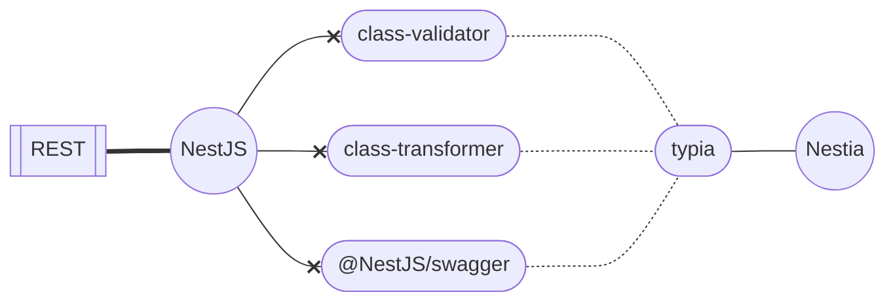

  

# RESTIA: `Nestia` + `NestJS` for `REST` APIs

```mermaid
flowchart LR
  REST[[REST]]
  NestJS((NestJS))
  Nestia((Nestia))
  ClassValidator([class-validator])
  ClassTransformer([class-transformer])
  SwaggerModule(["@NestJS/swagger"])
  typia([typia])

  REST === NestJS

  NestJS --x ClassValidator -..- typia
  NestJS --x ClassTransformer -..- typia
  NestJS --x SwaggerModule -..- typia

  typia --- Nestia
```
